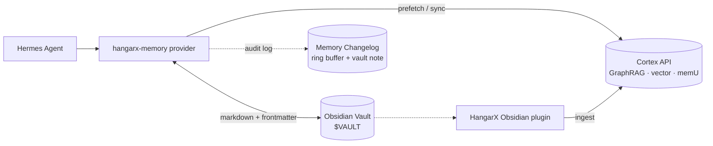

# hangarx-memory

> Hermes Agent memory provider for HangarX Cortex — GraphRAG knowledge
> graph, vector memory, memU agent memory, and optional Obsidian vault
> mirroring. Zero Python dependencies. Works offline against a local
> Docker stack with no API key.

`hangarx-memory` makes [HangarX Cortex](https://hangarx.ai) the memory
backend for [Hermes Agent](https://hermes-agent.nousresearch.com). Every
turn gets persisted into the knowledge graph, vector store, and memU;
prior context is recalled before each turn; and the model gets a small,
curated set of Cortex tools to read, write, audit, and revert memory
directly.

The plugin also has an **Obsidian vault** mode that mirrors
conversations to local markdown notes with proper frontmatter,
wikilinks, and Obsidian graph-view tagging. The vault sits alongside
Cortex as a human-readable working copy.

## Why this exists

Most memory systems are black boxes. `hangarx-memory` ships four
features nobody else combines:

| Capability | What it gives you | Tools |
|---|---|---|
| **Audit log + revert** | "What does the agent know about me, and how did it learn that?" — every mutation is logged with a memory id and you can undo any one of them. | `cortex_memory_changelog`, `cortex_revert_memory` |
| **Introspection** | "Show me what you actually remember." — one call returns stats, categories, sample items, and profile recall. | `cortex_about_me`, `cortex_memory_stats`, `cortex_memory_categories`, `cortex_memory_items` |
| **Sensitivity tags + agent-context gate** | Auto-detects API keys, JWTs, emails, phones. Refuses to write private/secret data from subagent or cron contexts. Suppresses prefetch in non-primary contexts by default. | implicit on every write |
| **Per-profile workspaces** | Two Hermes profiles (`coder`, `journaling`) get cleanly separate Cortex workspaces out of the box. | `workspace_template: "hermes-{identity}"` |
| **Perplexity-style citations** | Model ends replies with a `**Based on:**` footer listing the vault notes and memory ids it used. | passthrough directive in prefetch |

## Three operating modes

| Mode | `api_key` / local stack | `vault_path` | What you get |
|---|---|---|---|
| **Local-keyless** | local Docker stack | – | Full Cortex tools against `localhost:3400` with no API key. Auto-detected. |
| **Cortex-only (cloud)** | API key | – | Full Cortex tools against the hosted Cortex API. |
| **Vault-only** | – | set | Local Obsidian vault search + transcript notes. |
| **Hybrid** | either | set | All ~25 tools, merged prefetch, both writes. |

## Quickstart — local Docker stack (no API key needed)

The plugin ships with `docker-compose.cortex.yml`. One command spins up
FalkorDB + Cortex API; the plugin auto-detects the stack on next
Hermes start.

```bash
# 1. Install the plugin
git clone https://github.com/3-Elements-Design/hangarx-memory \
  ~/.hermes/plugins/hangarx-memory

# 2. Activate it inside Hermes
hermes config set memory.provider hangarx-memory

# 3. Start the local Cortex stack
hermes hangarx-memory docker up
```

That's it. The plugin auto-detects `http://localhost:3400` and runs in
**keyless local mode** — Cortex's `AUTH_OPTIONAL_FOR_LOCAL` accepts
unauthenticated requests on localhost. Your memory is local, on disk,
under your control.

### Local stack management

```bash
hermes hangarx-memory docker up        # start FalkorDB + Cortex API
hermes hangarx-memory docker status    # containers + live /health probe
hermes hangarx-memory docker logs -f   # stream logs (or: logs cortex-api)
hermes hangarx-memory docker down      # stop (volumes preserved)
hermes hangarx-memory docker down --purge   # stop + delete memory data
hermes hangarx-memory docker pull      # pre-fetch images
hermes hangarx-memory docker path      # print the compose file path
```

Resource defaults (tuned for a developer laptop): 2 GB memory limit, 1
CPU, ~512 MB reservation. Override via env vars on the host before
`docker up`:

```bash
# Use OpenAI instead of local Ollama for the LLM
LLM_PROVIDER=openai LLM_MODEL=gpt-4o-mini OPENAI_API_KEY=sk-... \
  hermes hangarx-memory docker up
```

## Install options

### Option 1 — git clone (most common)

```bash
git clone https://github.com/3-Elements-Design/hangarx-memory \
  ~/.hermes/plugins/hangarx-memory
```

### Option 2 — pip + symlink

```bash
pip install hangarx-memory
SITE=$(python -c "import hangarx_memory, os; print(os.path.dirname(os.path.dirname(hangarx_memory.__file__)))")
ln -s "$SITE" ~/.hermes/plugins/hangarx-memory
```

### Option 3 — monorepo symlink (development)

```bash
ln -s ~/Sites/hangarx-business-agent/packages/hangarx-memory \
      ~/.hermes/plugins/hangarx-memory
```

## Cloud Cortex (alternative to local Docker)

If you already have a hosted Cortex instance or want to use
`https://cortex.hangarx.ai`:

```bash
hermes config set memory.provider hangarx-memory
hermes memory setup     # prompts for CORTEX_API_KEY, workspace_id, etc.
```

Secrets land in `$HERMES_HOME/.env` (as `CORTEX_API_KEY`); everything
else lands in `$HERMES_HOME/hangarx-memory.json`. The plugin only
auto-detects local when no `base_url` is explicitly configured.

## Configuration

All knobs live in `~/.hermes/hangarx-memory.json`. Defaults shown.

### Connection

| Key | Default | Notes |
|---|---|---|
| `api_key` | – | Stored in `.env` as `CORTEX_API_KEY`. Optional in local mode. |
| `base_url` | auto-detect → `https://cortex.hangarx.ai` | Pinned URLs disable auto-detect. |
| `workspace_id` | from `workspace_template` | Explicit wins over template. |
| `organization_id` | – | Optional. |
| `auth_mode` | `bearer` | Or `x-api-key`. |
| `agent_id` | `hermes` | Identity inside memU. |
| `auto_detect_local` | `true` | Probe localhost on init. |
| `local_candidates` | `localhost:3400,localhost:4000` | Comma-separated; or env `CORTEX_LOCAL_URLS`. |
| `local_probe_timeout` | `0.5` | Seconds per candidate. |

### Profile + workspace isolation

| Key | Default | Notes |
|---|---|---|
| `workspace_template` | `hermes-{identity}` | `{identity}` = Hermes profile name. Empty disables. |

### Vault (Obsidian)

| Key | Default | Notes |
|---|---|---|
| `vault_path` | – | Absolute path. Or env `HANGARX_VAULT_PATH`. |
| `vault_sessions_folder` | `Hermes Sessions` | Subfolder for written notes. |
| `vault_sync_mode` | `per-session` | `off` / `per-session` / `daily` / `per-turn`. |
| `vault_link_style` | `wikilink` | Or `markdown`. |
| `vault_search_enabled` | `true` | Local search during prefetch. |
| `vault_compression_snapshots` | `false` | Save context-compression snapshots. |

### Cadence + retrieval

| Key | Default | Notes |
|---|---|---|
| `tool_mode` | `full` | `compact` exposes only 4 tools. |
| `prefetch_cadence` | `1` | Fire prefetch every N turns. `0` disables. |
| `profile_cadence` | `25` | Inject profile recall on turn 1 + every N. |
| `auto_promote_enabled` | `true` | Distill turns into facts on session end. |
| `auto_promote_limit` | `25` | Max items per auto-promote pass. |
| `stream_prefetch` | `true` | Use streaming `/v1/ask/chat/stream`. |
| `dialectic_passes` | `1` | 1–3; `2`+ enables refinement pass. |

### Audit + safety (v0.5.0)

| Key | Default | Notes |
|---|---|---|
| `changelog_enabled` | `true` | Audit log of every memory mutation. |
| `changelog_buffer_size` | `200` | Ring buffer size. |
| `sensitivity_enabled` | `true` | Tag writes + gate non-primary contexts. |
| `sensitivity_auto_detect` | `true` | Regex inference of secrets/PII. |
| `prefetch_in_subagent` | `false` | Opt in to subagent/cron prefetch. |
| `response_citations` | `true` | Append "Based on:" directive to prefetch. |
| `session_summary_enabled` | `true` | End-of-session digest note. |
| `citation_wikilinks` | `true` | Resolve citations to `[[wikilinks]]`. |

## CLI

```bash
hermes hangarx-memory status        # config + key + mode + local detect
hermes hangarx-memory test          # MCP tools/list round-trip
hermes hangarx-memory tools         # tools this plugin exposes
hermes hangarx-memory reflect       # trigger Cortex memU reflection
hermes hangarx-memory schedule      # cron snippet for nightly reflection

hermes hangarx-memory docker up     # start local Cortex stack
hermes hangarx-memory docker down   # stop (volumes kept)
hermes hangarx-memory docker status # containers + live /health
hermes hangarx-memory docker logs   # tail logs; -f to follow
hermes hangarx-memory docker pull   # pre-fetch images
hermes hangarx-memory docker path   # print compose file path

hermes hangarx-memory vault status  # vault root + sync mode + note count
hermes hangarx-memory vault list    # --folder, --tag, --limit
hermes hangarx-memory vault search  # --folder, --limit
hermes hangarx-memory vault open    # open vault in Finder (macOS)
```

## What it does in the agent loop

| Hermes hook | Cortex action | Vault action |
|---|---|---|
| `queue_prefetch(q)` | `POST /v1/ask/chat[/stream]` async | Synchronous local search |
| `prefetch(q)` | Returns merged context block | (same — merged) |
| `sync_turn(u, a)` | `POST /v1/memory/remember-raw` | Append turn to session note |
| `on_memory_write(...)` | `POST /v1/memory/remember` | Append bullet to `Hermes Memory.md` |
| `on_pre_compress(msgs)` | `POST /v1/memory/remember-raw` | Optional `Compressions/<id>.md` snapshot |
| `on_session_end(msgs)` | `auto_promote` + `reflect` | Write `Summaries/<id>.md` with backlinks |
| `on_session_switch(...)` | Reset prefetch cache + counter | (no-op) |
| `on_turn_start(n, msg)` | Bump turn counter for cadence | (no-op) |

All writes are non-blocking — vault writes happen on the same daemon
thread as Cortex writes so the agent loop never waits on disk or
network.

## Tools exposed to the model

### Cortex core (active when `api_key` is set or local stack reachable)

| Tool | Backed by |
|---|---|
| `cortex_recall` | `POST /v1/memory/recall` |
| `cortex_remember` | `POST /v1/memory/remember` |
| `cortex_ask` | `POST /v1/ask/chat/answer` |
| `cortex_search_documents` | `POST /v1/search/vectors/search` |
| `cortex_search_entities` | MCP `cortex_search_entities` |
| `cortex_query_graph` | MCP `cortex_query_graph` |
| `cortex_ingest` | MCP `cortex_ingest` |

### Audit + introspection (v0.4.1 + v0.5.0)

| Tool | What it does |
|---|---|
| `cortex_memory_stats` | Total items, categories, by priority |
| `cortex_memory_categories` | Categories + item counts |
| `cortex_memory_items` | Raw stored memory items (paginated) |
| `cortex_about_me` | Synthesis: stats + categories + sample + profile recall in one call |
| `cortex_memory_changelog` | Recent memory mutations (ADDED, MERGED, FORGOT, PROMOTED, REVERTED, BLOCKED) |
| `cortex_revert_memory` | Tombstone a memory by id + log REVERTED entry |
| `cortex_rate_memory` | Train trust + rerank signals |
| `cortex_resolve_uri` | Follow `vault://` and `cortex://` URIs |
| `cortex_find_duplicates` | Find near-duplicate entities |
| `cortex_merge_entities` | Merge two entities into one |

### Vault (active when `vault_path` is set)

| Tool | What it does |
|---|---|
| `vault_search` | Local content + filename match across the vault |
| `vault_read_note` | Read a note by path or `[[wikilink]]` |
| `vault_list_notes` | List notes by folder, tag, limit |
| `vault_create_note` | Write a new markdown note with frontmatter |
| `vault_append_note` | Append body + merge frontmatter |
| `cortex_ingest_vault` | (hybrid mode) promote a vault note into Cortex |

## What gets written

### Per-session conversation note

`$VAULT/Hermes Sessions/<YYYY-MM-DD>/<session_id>.md`:

```markdown
---
agent_id: hermes
created: 2026-05-19T15:04:23
platform: cli
session_id: 2026-05-19T15-04-cortex-design
type: hermes-session
tags: [hermes]
---

## 15:04 — User
how do I integrate Cortex with Hermes?

## 15:04 — Assistant
The cleanest path is the hangarx-memory plugin…
```

### Memory index

`$VAULT/Hermes Sessions/Hermes Memory.md`:

```markdown
- **2026-05-19 15:04** · `add` `user` → `user_fact`
    - User is named Iz
- **2026-05-19 15:05** · `replace` `memory` → `agent_instruction`
    - Prefer concise answers
```

### Changelog

`$VAULT/Hermes Sessions/Memory Changelog.md`:

```markdown
- **2026-05-19T15:04:00Z** · `ADDED` · `user_fact` · `mem_01abc`
    - User prefers concise replies
- **2026-05-19T15:04:12Z** · `MERGED` · `entity_merge` · `ent_main`
    - entities ent_dup → ent_main
- **2026-05-19T16:00:00Z** · `PROMOTED` · `auto_promote`
    - auto-promote distilled 7 memories
- **2026-05-19T16:05:00Z** · `REVERTED` · `user_revert` · `mem_01abc`
    - User said the agent was wrong about that
```

## Security & safety

- API keys live in `$HERMES_HOME/.env` (`CORTEX_API_KEY`), never in the JSON config. `save_config()` strips `api_key` before writing.
- Vault paths are resolved against the vault root with `resolve()` + `.relative_to(root)` — `../../` traversal is refused.
- Sensitivity tags auto-detect API keys, JWTs, emails, phones. Restricted writes from subagent/cron contexts are refused and logged as `BLOCKED` to the changelog.
- Prefetch is suppressed entirely in non-primary contexts by default — subagents and cron jobs don't inherit primary memory unless `prefetch_in_subagent: true` is explicitly set.

## Architecture



## Single external provider rule

Hermes only allows one external memory provider at a time. Activating
`hangarx-memory` replaces whatever was previously set as
`memory.provider`. The built-in Hermes memory tool (`MEMORY.md` /
`USER.md`) continues to work — it's the *external* provider slot that's
single-select.

## Troubleshooting

- **`hangarx-memory` doesn't appear in `hermes memory setup`** → plugin directory missing. Confirm `$HERMES_HOME/plugins/hangarx-memory/{plugin.yaml,__init__.py}` exist.
- **`hermes hangarx-memory docker up` fails with "docker daemon not reachable"** → start Docker Desktop (macOS/Windows) or `sudo systemctl start docker` (Linux).
- **Local stack starts but plugin says "no API key + no local Cortex"** → the auto-detect probe timed out. Run `hermes hangarx-memory docker status` to see container state; increase `local_probe_timeout` if your machine is slow.
- **No `vault_*` tools in the model's tool list** → `vault_path` is unset or not a directory. Check with `hermes hangarx-memory vault status`.
- **`hermes hangarx-memory test` fails with HTTP 401** → API key isn't being sent. Confirm `CORTEX_API_KEY` is in `$HERMES_HOME/.env` and that `auth_mode` matches what your key expects.
- **Vault notes written but Cortex memU empty** → `CORTEX_API_KEY` unset AND no local stack reachable. Plugin is in vault-only mode (intentional). Run `hermes hangarx-memory docker up` or `hermes memory setup`.

## References

- Cortex REST API: [API reference](https://app.hangarx.ai/docs/api-reference)
- Cortex MCP catalog: [MCP Server](https://app.hangarx.ai/docs/integrations/mcp-server)
- Hermes Agent: <https://hermes-agent.nousresearch.com/docs>
- Hermes memory provider plugin guide: <https://hermes-agent.nousresearch.com/docs/developer-guide/memory-provider-plugin>

## License

MIT. See [LICENSE](./LICENSE).
